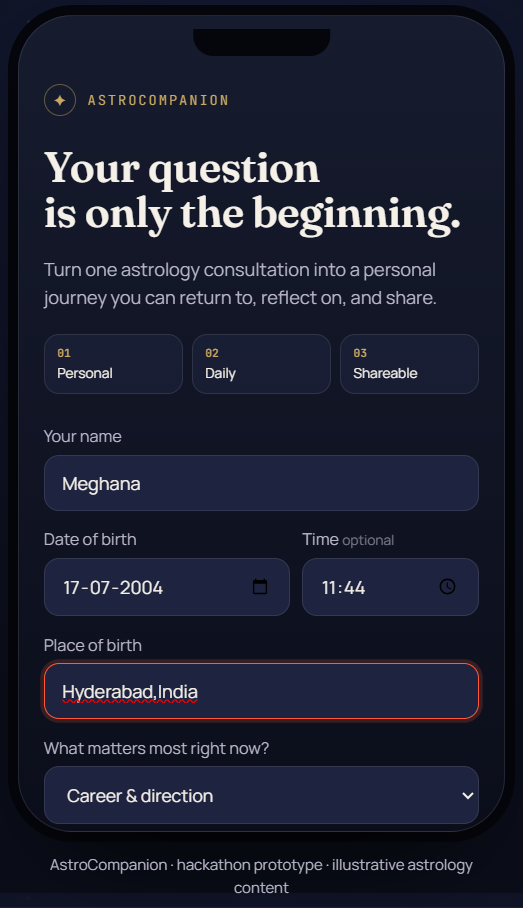
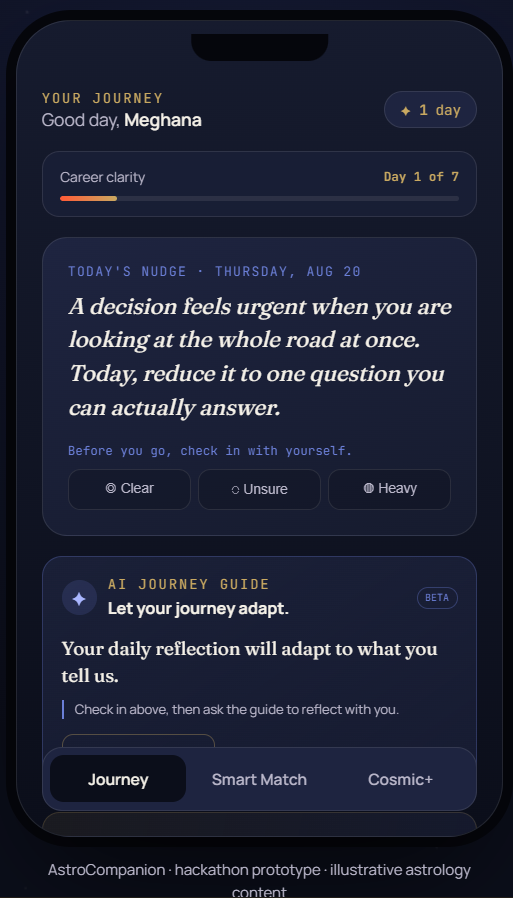
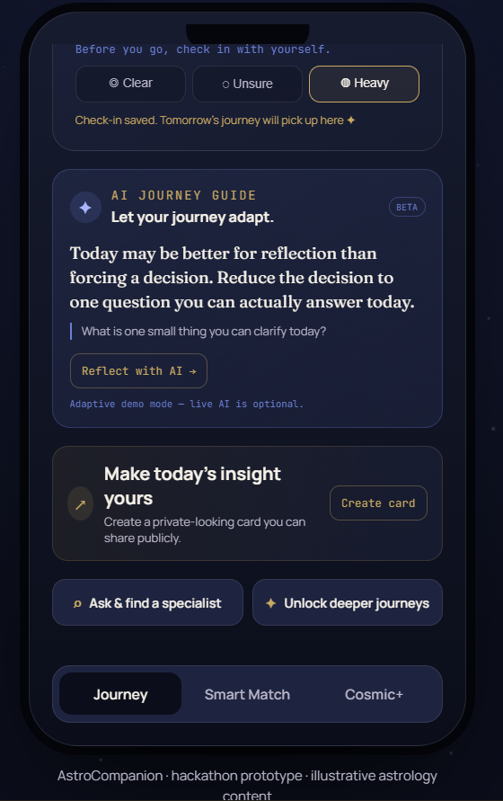
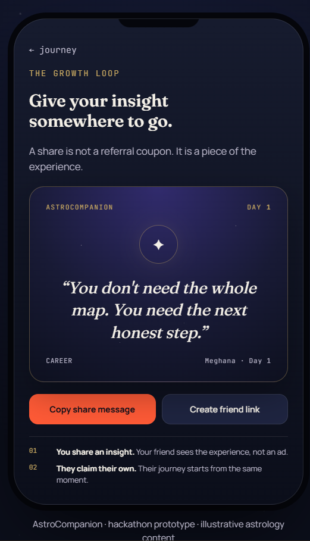
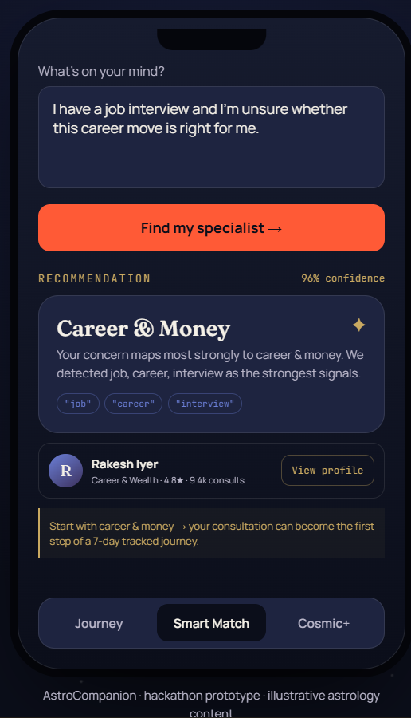

# AstroCompanion

> **AstroLive answers your question. AstroCompanion stays until you have the answer — and gives you something worth sharing on the way there.**

A working no-build-step prototype for the **AstroLive product challenge**.

## Live Demo

**Live Prototype:**  
https://YOUR_USERNAME.github.io/AstroLive-Companion/

**GitHub Repository:**  
https://github.com/PalankiMeghana/AstroLive-Companion

---

## Product thesis

AstroLive is primarily a reactive consultation marketplace. AstroCompanion adds a persistent layer around that marketplace:

**consultation → tracked 7-day journey → daily reflection → shareable insight → friend discovery → Smart Match → deeper paid journey**

The prototype deliberately demonstrates four connected levers rather than four unrelated features:

- **Habit:** a 7-day journey with daily check-ins and progress.
- **Structural virality:** a shareable insight generates a friend link that opens directly into a product experience.
- **USP:** Smart Match classifies a free-text concern and explains the specialist recommendation.
- **Revenue:** Cosmic+ monetizes depth and continuity rather than only per-minute calls.
- **AI:** the Journey Guide adapts reflections using the user's journey context and latest check-in.

---

# Product Experience

## 1. Personal Onboarding

The user starts by selecting what matters most to them.

This creates the context for the personalized journey.



---

## 2. Career Clarity — Day 1

The user enters a tracked 7-day journey with:

- journey progress
- daily insight
- mood check-in
- personalized content
- AI Journey Guide

This creates the foundation for the **habit loop**.



---

## 3. AI Journey Guide

The AI Journey Guide is intentionally not a generic chatbot.

It receives:

- user's journey topic
- current journey day
- user's concern
- latest check-in

and produces:

- an adaptive reflection
- one follow-up question

The purpose is to make the experience **change as the user's journey changes**.



---

## 4. Shareable Insight

The user's journey generates an insight that can be turned into a shareable card.

The goal is to make the **experience itself shareable**, rather than relying only on a referral coupon.



---

## 5. Smart Match — USP

Instead of making users browse a large marketplace and decide which specialist they need, Smart Match starts with the user's actual concern.

Example:

> "I have a job interview and I'm unsure whether this career move is right for me."

The prototype returns:

- recommended specialty
- confidence score
- detected signals
- explainable match reasoning
- recommended specialist



### Product principle

> **Don't make users diagnose which astrologer they need. Let them describe what is happening and route them.**

---

## 6. Cosmic+ — Revenue Expansion

Cosmic+ introduces a revenue layer around the user's ongoing journey rather than relying only on per-minute consultations.

```text
FREE
Daily journey
    ↓
DEEPEN
Personalized experiences
    ↓
CONNECT
Priority expert access
