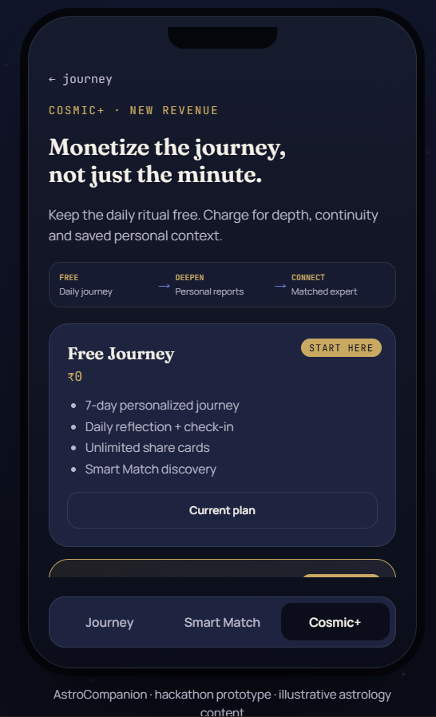

# AstroCompanion

> **AstroLive answers your question. AstroCompanion stays until you have the answer — and gives you something worth sharing on the way there.**

A working no-build-step prototype for the **AstroLive product challenge**.

---

## Live Demo

**Live Prototype:**  
`https://PalankiMeghana.github.io/AstroLive-Companion/`

> The GitHub Pages URL will become active after GitHub Pages is enabled for this repository.

**GitHub Repository:**  
https://github.com/PalankiMeghana/AstroLive-Companion

---

# Product Thesis

AstroLive is primarily a reactive consultation marketplace.

AstroCompanion adds a persistent product layer around that marketplace:

```text
Consultation
     ↓
Tracked 7-Day Journey
     ↓
Daily Reflection
     ↓
Shareable Insight
     ↓
Friend Discovery
     ↓
Smart Match
     ↓
Deeper Paid Journey
```

The central product thesis is:

> **The consultation should be the beginning of the journey, not the end of the transaction.**

The prototype deliberately demonstrates five connected product levers:

- **Habit:** a 7-day journey with daily check-ins and progress.
- **Structural virality:** a shareable insight generates a friend link that opens directly into a product experience.
- **USP:** Smart Match classifies a free-text concern and explains the specialist recommendation.
- **Revenue:** Cosmic+ monetizes depth and continuity rather than only per-minute calls.
- **AI:** the Journey Guide adapts reflections using journey context and the latest check-in.

---

# The Product Loop

```text
                       USER CONCERN
                            │
                            ▼
                    ┌───────────────┐
                    │  ONBOARDING   │
                    │ Personalize   │
                    └───────┬───────┘
                            │
                            ▼
                    ┌───────────────┐
                    │  7-DAY        │
                    │  JOURNEY      │
                    └───────┬───────┘
                            │
                            ▼
                    ┌───────────────┐
                    │ AI JOURNEY    │
                    │ GUIDE         │
                    └───────┬───────┘
                            │
                 ┌──────────┴──────────┐
                 ▼                     ▼
          SHAREABLE INSIGHT       NEED EXPERT?
                 │                     │
                 ▼                     ▼
          FRIEND DISCOVERY        SMART MATCH
                 │                     │
                 ▼                     ▼
           NEW USER JOURNEY       RIGHT SPECIALIST
                                       │
                                       ▼
                                    COSMIC+
```

This turns the product from a one-off consultation destination into a potentially recurring relationship.

---

# Product Experience

## 1. Personal Onboarding

The user starts by selecting what matters most to them.

This creates the context for the personalized journey rather than presenting a generic experience.


---

## 2. Career Clarity — Day 1

The user enters a tracked 7-day journey with:

- journey progress
- daily insight
- mood check-in
- personalized content
- AI Journey Guide

This creates the foundation for the **habit loop**.


---

## 3. AI Journey Guide

The AI Journey Guide is intentionally **not a generic chatbot**.

It receives:

- user's journey topic
- current journey day
- user's concern
- latest check-in

and produces:

- an adaptive reflection
- one follow-up question

The purpose is to make the experience **change as the user's journey changes**.


### AI Product Role

The AI layer acts as an adaptive reflection layer:

```text
User returns
     ↓
Journey context is available
     ↓
User checks in
     ↓
AI adapts the reflection
     ↓
Next question changes
```

The AI is therefore part of the **retention mechanism**, rather than simply being a chatbot added to the interface.

---

## 4. Shareable Insight

The user's journey generates an insight that can be turned into a shareable card.

The goal is to make the **experience itself shareable**, rather than relying only on a referral coupon.


### Structural Virality

The intended loop is:

```text
User A
  ↓
Completes / interacts with journey
  ↓
Creates personal insight
  ↓
Shares insight
  ↓
User B opens shared experience
  ↓
User B starts their own journey
  ↓
User B creates an insight
  ↓
User C
```

The product's content becomes part of the acquisition mechanism.

This is fundamentally different from:

```text
Refer a friend → receive a discount
```

because the shared object is part of the product experience itself.

---

## 5. Smart Match — USP

Instead of making users browse a large marketplace and decide which specialist they need, Smart Match starts with the user's actual concern.

Example:

> "I have a job interview and I'm unsure whether this career move is right for me."

The prototype returns:

- recommended specialty
- confidence score
- detected signals
- explainable match reasoning
- recommended specialist


### Product Principle

> **Don't make users diagnose which astrologer they need. Let them describe what is happening and route them.**

### Smart Match Flow

```text
Free-text concern
       ↓
Normalize input
       ↓
Detect relevant signals
       ↓
Score specialties
       ↓
Calculate confidence
       ↓
Recommend specialist
       ↓
Explain why
```

The current prototype uses deterministic, explainable matching logic.

A production implementation could later replace or augment this with semantic embeddings or a learned recommendation model.

---

## 6. Cosmic+ — Revenue Expansion

Cosmic+ introduces a revenue layer around the user's ongoing journey rather than relying only on per-minute consultations.

```text
FREE
Daily journey
    ↓
DEEPEN
Personalized experiences
    ↓
CONNECT
Priority expert access
```



### Revenue Thesis

The existing consultation model does not need to disappear.

AstroCompanion adds additional monetizable moments around it:

```text
Free Journey
     ↓
Habit / Retention
     ↓
Premium Journey
     ↓
Cosmic+
     ↓
Expert Connection
```

Potential future revenue opportunities include:

- Cosmic+ membership
- personalized deep-dive reports
- premium journey packs
- compatibility experiences
- priority expert matching
- consultation conversion

> **Monetize the journey, not just the minute.**

---

# Why This Is One Product, Not Five Features

The major product opportunity is the connection between the levers.

```text
PERSONALIZATION
      ↓
HABIT
      ↓
AI ADAPTATION
      ↓
SHAREABLE VALUE
      ↓
ORGANIC ACQUISITION
      ↓
SMART MATCH
      ↓
EXPERT CONVERSION
      ↓
PREMIUM JOURNEY
```

Each stage creates the input for the next stage.

This is what makes the proposal structurally different from adding an isolated chatbot, referral program, or subscription screen.

---

# AI Architecture

The prototype includes an optional Python Flask backend for the AI Journey Guide.

```text
                         BROWSER
                            │
                            │ POST /api/journey
                            ▼
                       FLASK API
                            │
                 ┌──────────┴──────────┐
                 │                     │
          API key available      API unavailable
                 │                     │
                 ▼                     ▼
             LIVE LLM          DETERMINISTIC
                                ADAPTIVE FALLBACK
```

The AI receives:

```text
Journey topic
+
Journey day
+
User concern
+
Today's check-in
```

and produces:

```text
Adaptive reflection
+
Follow-up question
```

### Reliability

The prototype has a deterministic fallback so the core product experience does not completely depend on an external AI service being available.

This is important for a hackathon prototype because the demo can remain functional even if the live AI service is unavailable.

---

# AI Safety Boundary

The AI Journey Guide is designed as a **reflection and personalization layer**, not as an automated replacement for professional astrologers.

It should not:

- claim supernatural certainty
- diagnose medical conditions
- provide medical advice
- provide legal advice
- provide financial advice

The production product should maintain clear boundaries between reflective guidance and professional consultation.

---

# Technology

## Frontend

- HTML5
- CSS3
- Vanilla JavaScript
- LocalStorage

## Backend

- Python
- Flask
- Flask-CORS

## AI

- OpenAI API through the server-side Python backend
- deterministic fallback for reliable prototype operation

## Deployment

- GitHub
- GitHub Pages for the static frontend

---

# Project Structure

```text
AstroLive-Companion/
│
├── index.html
├── styles.css
├── data.js
├── matching.js
├── app.js
├── README.md
├── LICENSE
│
├── backend/
│   ├── app.py
│   └── requirements.txt
│
└── docs/
    └── screenshots/
        ├── 1.png
        ├── 2.png
        ├── 3.png
        ├── 4.png
        ├── 5.png
        └── 6.png
```

---

# Run Locally

## Frontend

From the project root:

```bash
python -m http.server 8000
```

Open:

```text
http://localhost:8000
```

The frontend is intentionally built without a frontend build step.

---

## Optional AI Backend

Open a second terminal:

```bash
cd backend
python -m venv .venv
```

### Windows

```powershell
.venv\Scripts\Activate.bat
pip install -r requirements.txt
python app.py
```

The backend runs at:

```text
http://127.0.0.1:5000
```

Health check:

```text
http://127.0.0.1:5000/api/health
```

Expected response:

```json
{
  "ok": true
}
```

---

# AI API Key

For live AI generation, configure the key only in the backend environment.

PowerShell:

```powershell
$env:OPENAI_API_KEY="YOUR_KEY"
python app.py
```

Never place an API key inside:

- `app.js`
- `index.html`
- `data.js`
- GitHub
- the public frontend

If no API key is configured, the prototype uses its deterministic adaptive fallback.

---

# GitHub Pages Deployment

The frontend is a static no-build-step application, so it can be deployed directly through GitHub Pages.

### Step 1

Open the repository:

**Settings → Pages**

### Step 2

Under **Build and deployment**, choose:

```text
Source: Deploy from a branch
```

### Step 3

Select:

```text
Branch: main
Folder: / (root)
```

Then click:

**Save**

### Step 4

GitHub will provide a URL similar to:

```text
https://PalankiMeghana.github.io/AstroLive-Companion/
```

After deployment completes, open the URL and verify:

- onboarding loads
- navigation works
- journey scroll works
- AI Journey Guide works/falls back correctly
- Smart Match works
- share experience works
- Cosmic+ loads correctly

### Important

GitHub Pages hosts the **static frontend**.

The local Flask backend at:

```text
http://127.0.0.1:5000
```

cannot be hosted by GitHub Pages.

For the public prototype, the deterministic fallback allows the frontend experience to remain functional.

A production deployment would host the Flask/API layer separately.

---

# Recommended Demo Flow

The strongest demonstration sequence is:

```text
1. Onboarding
      ↓
2. Career Clarity — Day 1
      ↓
3. AI Journey Guide
      ↓
4. Shareable Insight
      ↓
5. Smart Match
      ↓
6. Cosmic+
```

The story becomes:

> **Personalize → Return → Adapt → Share → Match → Monetize**

---

# Success Metrics

| Objective | Primary Metric |
|---|---|
| Habit | 7-day journey completion rate |
| Retention | D1 → D7 return rate |
| Virality | Share rate |
| Virality | Shared-link → new-user conversion |
| AI | AI reflection interaction rate |
| Matching | Smart Match → profile click rate |
| Marketplace | Match → consultation conversion |
| Revenue | Free → Cosmic+ conversion |
| Revenue | Revenue per active user |

## North Star Metric

### 7-Day Journey Completion Rate

This measures whether AstroCompanion successfully transforms a one-time interaction into an ongoing product relationship.

---

# Prototype vs Production

## Working Prototype

The prototype demonstrates:

- personalized onboarding
- 7-day journey
- journey progress
- local persistence
- daily check-ins
- AI Journey Guide integration
- deterministic AI fallback
- shareable insight
- friend-loop experience
- Smart Match classifier
- explainable recommendation
- Cosmic+ product flow

## Illustrative Prototype Content

The following are mock/illustrative values used to demonstrate the proposed experience:

- astrologer identities
- ratings
- consultation counts
- pricing
- astrology interpretations
- consultation availability
- checkout

These should not be interpreted as claims about real AstroLive data.

---

# Scalability

The prototype architecture can evolve into a production system without changing the core product experience.

```text
Static Prototype
      ↓
Frontend Application
      ↓
API Layer
      ↓
Journey Service
      ↓
User / Journey State
      ↓
AI Orchestration
      ↓
Matching Service
      ↓
Analytics
```

Potential production components include:

- persistent user profiles
- real astrology/chart calculation services
- semantic matching
- recommendation models
- event analytics
- notification infrastructure
- secure authentication
- payment processing
- production AI gateway

---

# Security & Privacy

- API keys remain server-side.
- No secrets are included in the frontend.
- Prototype journey state is stored locally.
- No payment information is collected.
- No production customer database is connected.

---

# AI & External Source Disclosure

AI assistance was used during development for:

- product ideation
- UX and product-flow design
- code generation
- debugging
- copy refinement
- architecture discussion

The final prototype was reviewed and integrated into the project by the team.

External sources used to support claims about AstroLive, competitors, market behavior, user behavior, and business assumptions will be cited in the final project report as required by the challenge.

---

# Team

**Team:** `ADD TEAM NAME`

**Team Leader:** `ADD LEADER NAME`

---

# License

This project is released under the **MIT License** for the purposes of the AstroLive hackathon prototype.
